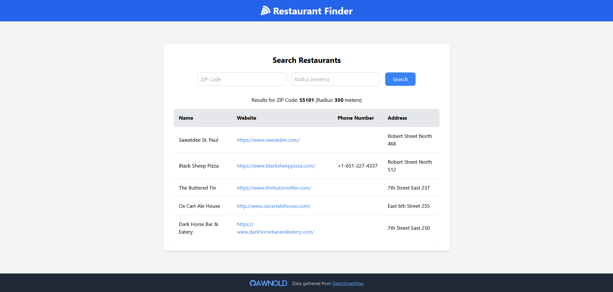

# Restaurant Finder

A simple web app to search for restaurants in any ZIP code using the OpenStreetMap Overpass API.



## Features
- Search for restaurants by ZIP code and radius.
- View restaurant details such as name, website, phone number, and address.
- Uses the OpenStreetMap Overpass API to fetch restaurant data.
- Uses the Zippopotamus API to convert ZIP codes to latitude and longitude.

## How to Run
1. Clone the repository:
   ```bash
   git clone https://github.com/awnold/restaurant-finder.git
   ```

2. Navigate into the project directory:
   ```bash
   cd restaurant-finder
   ```

3. Install the required Python packages:
   ```bash
   pip install -r requirements.txt
   ```

4. Run the Flask web app:
   ```bash
   python app.py
   ```

5. Open your browser and visit `http://127.0.0.1:5000/` to use the application.

## Technologies Used
- Python
- Flask
- Tailwind CSS
- OpenStreetMap Overpass API
- Zippopotamus API